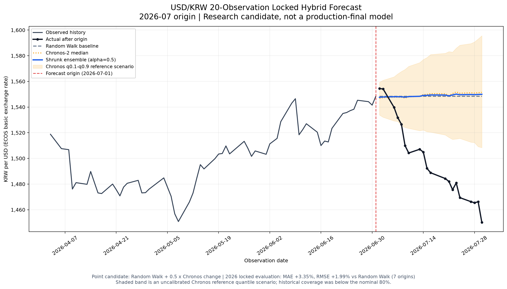

# FX Chronos

한국은행 ECOS의 USD/KRW 일별 매매기준율과 Amazon Chronos-2를 이용해 환율 경로를 예측하고, 기업의 외화 지급·수취 계약을 원화 손익 시나리오로 변환하는 연구 프로젝트입니다.

현재 구현 범위는 **USD/KRW 20개 관측 영업일 예측과 환위험 계산**입니다. Random Walk를 정직한 기준선으로 유지하고, Chronos-2의 점 예측과 분위수 예측은 검증 결과에 맞는 제한된 역할로 사용합니다.

## 현재 결과

| 영역 | 결과 | 현재 판정 |
|---|---|---|
| ECOS 데이터 | 1964-05-04~2026-07-30, 전체 17,476행 | 수집·검증·원본 보존 완료 |
| 모델 입력 데이터 | 월~금 관측 15,405행 | 보간 없는 단변량 시계열 확정 |
| 기준 모델 | Random Walk | 최종 Test에서 가장 낮은 MAE·RMSE |
| Chronos-2 Zero-shot | context length 756, 20-step 예측 | 변화 경로와 분위수 시나리오 후보 |
| LoRA 파인튜닝 | 고정 후보의 최종 Test 완료 | 일반화 가능한 개선 미확인, 연구용 보존 |
| 축소 앙상블 | `α=0.5` | 2026년 7개 기준일에서 잠정 통과 |
| 예측 구간 | Chronos q0.1~q0.9 및 고정 보정 평가 | 목표 포함률 미달, 참고 시나리오로만 사용 |
| 환위험 분석 | 지급·수취, 부분 헤지, 원화 손익 계산 | 기능 구현 및 단위 테스트 완료 |

## 데이터 정의

사용 시계열은 한국은행 ECOS 통계표 `731Y001`의 일별 원/미국달러 매매기준율입니다.

```text
STAT_CODE  = 731Y001
CYCLE      = D
ITEM_CODE1 = 0000001
ITEM_NAME1 = 원/미국달러(매매기준율)
UNIT_NAME  = 원
```

| 데이터 | 행 수 | 기간 | 정책 |
|---|---:|---|---|
| ECOS 처리 원본 | 17,476 | 1964-05-04~2026-07-30 | ECOS가 반환한 주말 관측 포함 |
| 모델 입력 | 15,405 | 1964-05-04~2026-07-30 | 월~금 관측만 사용 |
| 주말 감사 데이터 | 2,071 | 1964-05-09~2006-02-25 | 모델에서 제외한 행을 별도 보존 |

모델 데이터에는 평일의 빈 날짜를 새로 만들지 않으며 전일값 채우기나 선형보간을 하지 않습니다. 따라서 `1 step`은 달력상의 하루가 아니라 **다음 실제 평일 ECOS 관측값**을 뜻합니다.

## 예측 모델과 역할

### Random Walk

마지막 관측 환율을 미래에도 유지하는 기준 모델입니다. 2022~2025 최종 Test에서 Chronos-2 Zero-shot과 LoRA보다 낮은 MAE와 RMSE를 기록했으므로 현재 가장 강한 점 예측 기준선입니다.

### Chronos-2 Zero-shot

`amazon/chronos-2`를 단변량 USD/KRW 시계열에 직접 적용합니다. 현재 선택된 입력 길이는 756개 관측이고 예측 길이는 20개 관측입니다. 점 예측 후보뿐 아니라 q0.1, q0.5, q0.9 시나리오를 제공합니다.

### 축소 앙상블

Random Walk 경로에서 Chronos-2가 제시한 변화량의 일부만 반영합니다.

```text
앙상블 예측(h)
= 마지막 관측 환율
+ α × [Chronos 예측(h) - 마지막 관측 환율]
```

2018~2021 Validation에서 사전 정의된 후보 중 `α=0.5`가 선택됐습니다. 이 값은 운영 최적값이 아니라 신규 구간에서 계속 검증할 고정 연구 후보입니다.

### LoRA

Chronos-2 LoRA 파인튜닝과 평가 파이프라인은 구현돼 있습니다. 다만 현재 데이터 분할과 설정에서는 Zero-shot이나 Random Walk보다 일반화 가능한 성능 개선을 확인하지 못했으므로 운영 후보가 아닙니다.

## 핵심 성능

### 2022~2025 최종 Test

48개 월별 기준일, 총 960개 20-step 예측 결과입니다.

| 모델 | MAE | RMSE |
|---|---:|---:|
| Random Walk | **20.7573** | **28.4835** |
| Chronos-2 Zero-shot | 21.3173 | 29.3309 |
| Chronos-2 LoRA | 21.3323 | 29.3673 |

이 구간에서는 Random Walk가 가장 우수했습니다. LoRA의 Zero-shot 대비 기준일별 승률도 MAE 50.0%, RMSE 52.08%로 일관된 우위를 보이지 않았습니다.

### 2018~2021 축소 앙상블 Validation

| 모델 | MAE | RMSE | RW 대비 MAE 개선 | RW 대비 RMSE 개선 |
|---|---:|---:|---:|---:|
| Random Walk (`α=0`) | 12.259792 | 15.967171 | - | - |
| 축소 앙상블 (`α=0.5`) | **12.104315** | **15.834602** | **1.268%** | **0.830%** |

`α=0.5`는 48개 기준일 중 MAE 32회, RMSE 31회 Random Walk를 이겼습니다. 개선폭은 작고 2019년 RMSE는 0.168% 악화됐으므로 모든 기간에서 우수하다고 해석하지 않습니다.

### 2026년 고정 소표본 평가

2018~2021에서 선택한 `α=0.5`를 변경하지 않고 2026년 1~7월의 7개 월별 기준일, 총 140행에 적용했습니다.

| 모델 | MAE | RMSE |
|---|---:|---:|
| Random Walk | 36.080714 | 42.368323 |
| 축소 앙상블 (`α=0.5`) | 34.872399 | 41.523387 |
| Chronos-2 Zero-shot | **33.679461** | **40.763084** |

축소 앙상블은 Random Walk 대비 MAE 3.349%, RMSE 1.994% 개선했고 7개 기준일 중 6개에서 두 지표를 모두 개선했습니다. 사전 조건은 통과했지만 표본이 작으므로 판정은 `provisional_due_to_small_sample`입니다. 이 결과로 α를 다시 조정하지 않습니다.



## 예측 구간 판정

Chronos-2의 q0.1~q0.9 범위는 명목상 80% 구간을 의도하지만 실제 포함률은 이에 미달했습니다.

| 평가 구간 | 보정 전 포함률 | 보정 후 포함률 | 판정 |
|---|---:|---:|---|
| 2020~2021 내부 평가 | 74.79% | 82.71% | 내부 평균 개선 확인 |
| 2026년 7개 기준일 | 54.29% | 57.86% | 목표 80% 미달 |

2018~2019에서 계산한 고정 대칭 보정값 `3.008544921875원`은 2026년 신규 소표본에서 재현되지 않았습니다. 따라서 원시 분위수와 보정 구간 모두 확정적인 80% 신뢰구간이 아니라 **참고용 위험 시나리오**입니다.

## 환위험 분석

예측 결과를 기업 계약과 연결하는 계산 엔진이 구현돼 있습니다.

- 지급 또는 수취 계약
- 외화 금액과 결제일
- 현재 기준환율
- 헤지 금액 또는 헤지 비율
- 헤지 환율
- 시나리오별 원화 지급·수취액
- 기준환율 대비 유리·불리 손익
- 완전 무헤지 대비 헤지 효과
- JSON·CSV 결과 저장

USD 1,000,000, 50% 헤지, 기준환율과 헤지환율 1,548.4원, 결제일 2026-07-30인 가상 지급 계약의 결과는 다음과 같습니다.

| 시나리오 | 환율 | 총 원화 지급액 | 기준 대비 유리한 손익 |
|---|---:|---:|---:|
| 앙상블 점 예측 | 1,549.9249 | 1,549,162,427원 | -762,427원 |
| Chronos 하한 | 1,508.3633 | 1,528,381,641원 | +20,018,359원 |
| Chronos 중앙 | 1,551.4497 | 1,549,924,854원 | -1,524,854원 |
| Chronos 상한 | 1,595.5544 | 1,571,977,222원 | -23,577,222원 |

수취 계약은 같은 총 원화 금액을 사용하되 기업에 유리한 손익의 부호가 반대입니다. 이 기능은 위험 시나리오 계산용이며 특정 금융상품이나 최적 헤지 비율을 추천하지 않습니다.

## 구현 기능

- ECOS `StatisticSearch` 항목 지정 및 전체 페이지 수집
- 원본 JSON 스냅샷과 처리 CSV 분리 보존
- 통계표·항목·단위·날짜·숫자값·중복 검증
- 주말 관측 분리와 감사 CSV 생성
- Chronos-2 단변량 Zero-shot 예측과 분위수 출력
- Random Walk 기준 모델
- 시간순 Walk-forward 백테스트
- MAE, RMSE, 방향 정확도, Pinball Loss, 구간 포함률과 폭 평가
- Chronos-2 LoRA 학습·선택·최종 Test
- Random Walk/Chronos 축소 앙상블과 잠금 평가
- 예측 구간 보정의 내부·신규 구간 평가
- 공통 예측 시나리오 인터페이스
- 지급·수취 환위험 계산 및 결과 내보내기
- 11개 단위 테스트

## 실행 환경

검증된 환경은 Apple Silicon macOS, Python 3.14.6입니다.

```text
numpy==2.5.1
pandas==3.0.5
matplotlib==3.11.1
torch==2.13.0
chronos-forecasting==2.3.1
peft==0.20.0
```

환경 생성:

```bash
cd fx-chronos
python3.14 -m venv .venv
.venv/bin/python -m pip install -r requirements.txt
```

ECOS 수집에는 환경변수 `ECOS_API_KEY`가 필요합니다. 실제 키를 코드나 저장소에 기록하지 않습니다.

전체 단위 테스트:

```bash
fx-chronos/.venv/bin/python -B -m unittest discover -s fx-chronos/tests -v
```

환위험 예시 실행:

```bash
fx-chronos/.venv/bin/python -B fx-chronos/src/run_hedge_analysis.py \
  --config fx-chronos/configs/hedge_example.json
```

수집·평가·분석 스크립트는 기존 결과를 조용히 덮어쓰지 않습니다. 동일 설정을 다시 실행할 때는 출력 파일의 보존 여부와 새 저장 경로를 먼저 확인해야 합니다.

## 저장소 구조

```text
dong-k-k/
├── fx-chronos/
│   ├── AGENTS.MD             # 환율 예측 프로젝트 원칙과 의사결정
│   ├── README.md             # 환율 예측 프로젝트 결과 요약
│   ├── docs/                 # 데이터·모델 설명과 결과 보고서
│   ├── configs/              # 평가·앙상블·보정·환위험 설정
│   ├── data/
│   │   ├── raw/              # ECOS 원본 응답 스냅샷
│   │   └── processed/        # 처리 데이터와 주말 감사 데이터
│   ├── outputs/
│   │   ├── forecasts/        # 예측 결과
│   │   ├── metrics/          # 평가 지표와 판정 기록
│   │   ├── figures/          # 결과 시각화
│   │   └── hedge_analysis/   # 환위험 JSON·CSV
│   ├── src/                  # 수집·예측·평가·환위험 코드
│   ├── tests/                # 단위 테스트
│   └── requirements.txt      # 검증된 의존성 버전
└── financial-product-rag/    # 팀원이 구현할 금융상품 추천 RAG 영역
```

## 현재 제한 사항

- 현재 검증 통화는 USD/KRW 하나입니다.
- 현재 집중 예측 길이는 20개 실제 평일 관측입니다. 60일은 연구 대상이고 90일·180일은 보류 상태입니다.
- 2022~2025 최종 Test에서는 Random Walk가 Chronos 계열보다 우수했습니다.
- 2026년 앙상블 평가는 기준일이 7개뿐이므로 운영 성능을 확정할 수 없습니다.
- Chronos 분위수는 목표 포함률을 안정적으로 달성하지 못했습니다.
- ECOS 매매기준율은 시장 종가나 실제 은행 고객 적용환율과 같지 않습니다.
- 환위험 계산에는 은행 스프레드, 수수료, 세금, 상품 조건과 신용위험이 포함되지 않습니다.
- 외생변수와 다통화 확장은 아직 현재 모델에 포함되지 않았습니다.

## 상세 문서

- [ECOS 데이터 정의와 조사 결과](docs/ecos-static.md)
- [Chronos-2 사용 정의](docs/chronos.md)
- [재현성과 현재 모델 판정](docs/reproducibility.md)
- [LoRA 및 최종 Test 결과](docs/results/usdkrw_h20_lora_evaluation.md)
- [축소 앙상블 Validation](docs/results/usdkrw_h20_shrunk_ensemble_validation.md)
- [축소 앙상블 2026년 고정 평가](docs/results/usdkrw_h20_shrunk_ensemble_2026_locked.md)
- [예측 구간 내부 보정 평가](docs/results/usdkrw_h20_interval_calibration_internal.md)
- [예측 구간 2026년 고정 평가](docs/results/usdkrw_h20_interval_calibration_2026_locked.md)
- [환위험 분석 예시](docs/results/usdkrw_hedge_analysis_examples.md)

## 해석 원칙

이 프로젝트의 결과는 환율 위험을 수치화하기 위한 연구·의사결정 보조 자료입니다. 예측값은 미래 환율을 보장하지 않으며, 예측 결과만으로 특정 금융상품 가입이나 헤지 비율을 자동 결정하지 않습니다.
